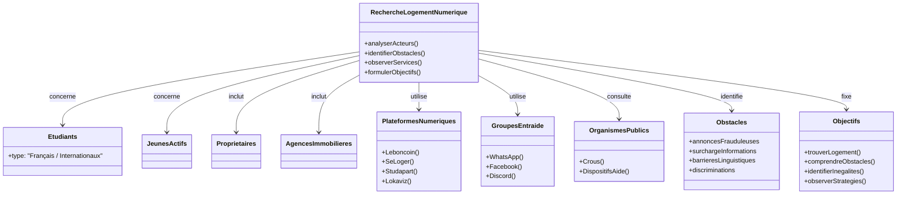

```mermaid
classDiagram

%% =============================
%%        CLASSES PRINCIPALES
%% =============================

class RechercheLogementNumerique {
    +analyserActeurs()
    +identifierObstacles()
    +observerServices()
    +formulerObjectifs()
}

%% -------- ACTEURS --------
class Etudiants {
    +type: "Français / Internationaux"
}

class JeunesActifs {
}

class Proprietaires {
}

class AgencesImmobilieres {
}

%% -------- SERVICES --------
class PlateformesNumeriques {
    +Leboncoin()
    +SeLoger()
    +Studapart()
    +Lokaviz()
}

class GroupesEntraide {
    +WhatsApp()
    +Facebook()
    +Discord()
}

class OrganismesPublics {
    +Crous()
    +DispositifsAide()
}

%% -------- OBSTACLES --------
class Obstacles {
    +annoncesFrauduleuses
    +surchargeInformations
    +barrieresLinguistiques
    +discriminations
}

%% -------- OBJECTIFS --------
class Objectifs {
    +trouverLogement()
    +comprendreObstacles()
    +identifierInegalites()
    +observerStrategies()
}

%% =============================
%%        RELATIONS
%% =============================

RechercheLogementNumerique --> Etudiants : concerne
RechercheLogementNumerique --> JeunesActifs : concerne
RechercheLogementNumerique --> Proprietaires : inclut
RechercheLogementNumerique --> AgencesImmobilieres : inclut

RechercheLogementNumerique --> PlateformesNumeriques : utilise
RechercheLogementNumerique --> GroupesEntraide : utilise
RechercheLogementNumerique --> OrganismesPublics : consulte

RechercheLogementNumerique --> Obstacles : identifie
RechercheLogementNumerique --> Objectifs : fixe

```
