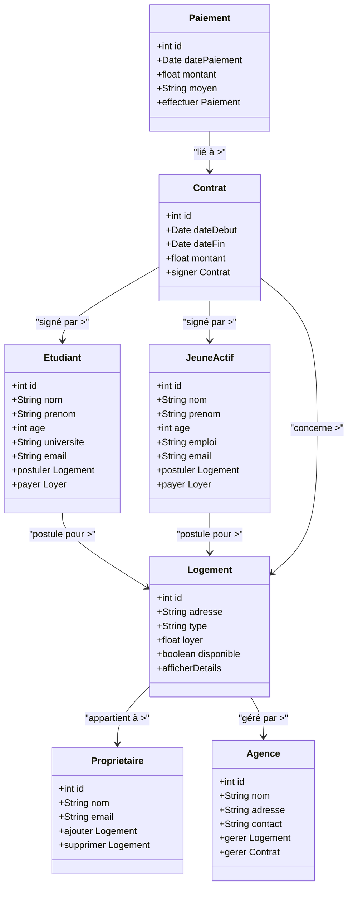

```mermaid
classDiagram
    class Etudiant {
        +int id
        +String nom
        +String prenom
        +int age
        +String universite
        +String email
        +postuler Logement
        +payer Loyer
    }

    class JeuneActif {
        +int id
        +String nom
        +String prenom
        +int age
        +String emploi
        +String email
        +postuler Logement
        +payer Loyer
    }

    class Logement {
        +int id
        +String adresse
        +String type
        +float loyer
        +boolean disponible
        +afficherDetails
    }

    class Proprietaire {
        +int id
        +String nom
        +String email
        +ajouter Logement
        +supprimer Logement
    }

    class Agence {
        +int id
        +String nom
        +String adresse
        +String contact
        +gerer Logement
        +gerer Contrat
    }

    class Contrat {
        +int id
        +Date dateDebut
        +Date dateFin
        +float montant
        +signer Contrat
    }

    class Paiement {
        +int id
        +Date datePaiement
        +float montant
        +String moyen
        +effectuer Paiement
    }

    %% Relations
    Etudiant --> Logement : "postule pour >"
    JeuneActif --> Logement : "postule pour >"
    Logement --> Proprietaire : "appartient à >"
    Logement --> Agence : "géré par >"
    Contrat --> Logement : "concerne >"
    Contrat --> Etudiant : "signé par >"
    Contrat --> JeuneActif : "signé par >"
    Paiement --> Contrat : "lié à >"
```
