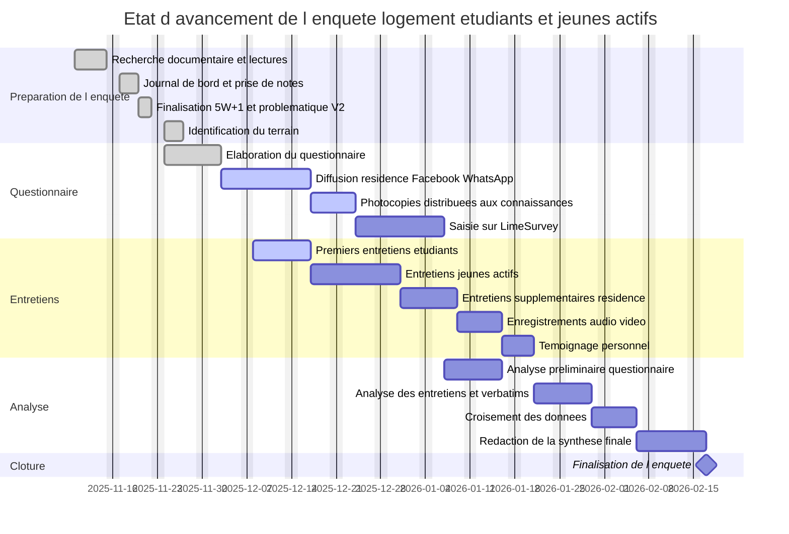

```mermaid
gantt
    dateFormat  YYYY-MM-DD
    title       Etat d avancement de l enquete logement etudiants et jeunes actifs
    excludes    weekends

    section Preparation de l enquete
    Recherche documentaire et lectures           :done,    prep1, 2025-11-10, 5d
    Journal de bord et prise de notes             :done,    prep2, after prep1, 3d
    Finalisation 5W+1 et problematique V2         :done,    prep3, after prep2, 2d
    Identification du terrain                    :done,    prep4, after prep3, 3d

    section Questionnaire
    Elaboration du questionnaire                 :done,    q1, 2025-11-24, 7d
    Diffusion residence Facebook WhatsApp        :active,  q2, after q1, 10d
    Photocopies distribuees aux connaissances    :active,  q3, after q2, 5d
    Saisie sur LimeSurvey                        :         q4, after q3, 10d

    section Entretiens
    Premiers entretiens etudiants                :active,  e1, 2025-12-08, 7d
    Entretiens jeunes actifs                     :         e2, after e1, 10d
    Entretiens supplementaires residence         :         e3, after e2, 7d
    Enregistrements audio video                  :         e4, after e3, 5d
    Temoignage personnel                         :         e5, after e4, 3d

    section Analyse
    Analyse preliminaire questionnaire            :         a1, after q4, 7d
    Analyse des entretiens et verbatims           :         a2, after e5, 7d
    Croisement des donnees                        :         a3, after a2, 5d
    Redaction de la synthese finale               :         a4, after a3, 7d

    section Cloture
    Finalisation de l enquete                     :milestone, end, after a4, 0d
```
